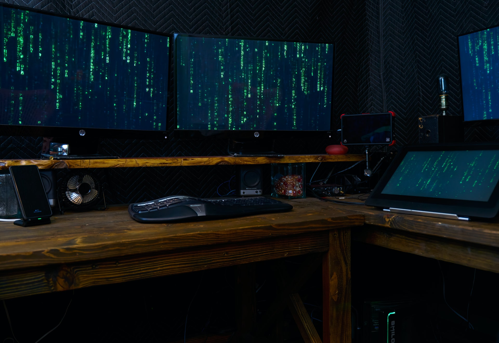

# Mirror Tutorial

Welcome to the Mirror Tutorial! The goal of this tutorial is to introduce the Web 3 development process in the context of a full stack application. Specifically, we'll be bridging common Web 2.0 concepts by building a blog using a Web 3 stack. As you build, we'll introduce key concepts to help you scaffold your development mental model and start adding Web 3 skills into your toolbox.

## Prerequisites

If you know how to program and have [JavaScript](https://www.javascript.com/) experience, you'll be able to complete the tutorial. Having said that, this will be a more comfortable experience if you have some experience with [TypeScript](https://www.typescriptlang.org/) and [React](https://reactjs.org/). While you may not have built full stack Web 3 applications, hopefully you have used a crypto wallet like [MetaMask](https://metamask.io/) and you are familiar with basic blockchain concepts like public address, private keys, and signing transactions.

If any of that sounds unfamiliar, or the idea of engaging with those concepts sounds daunting at this point in your learning, we recommend starting with the [Solana Wallet](https://learn.figment.io/tutorials/solana-wallet-intro) tutorial before completing this one.

We think of ourselves as your guide - for a brief amount of time - on your journey to build a better internet. We hope you walk away with a better understanding of what it takes to build full stack Web 3 decentralized applications (dApps) and perhaps even a bit more confidence to tackle significant projects.

We've tried to show you the door (or maybe part of it). Your job is to discover your path and walk it courageously.




Figure 1: “I do not believe it to be a matter of hope, it is simply a matter of time.”

# Step 1: Up and Running

## System Dependencies

Make sure you have [git](https://git-scm.com/book/en/v2/Getting-Started-Installing-Git), [Node](https://nodejs.org/en/) and [yarn](https://yarnpkg.com/getting-started/install) installed.

## Setting Up

You'll be building the blog application on top of a [Next.js](https://nextjs.org/) template that we have pre-built. This way you can quickly scaffold your way into developing the Web 3 application stack with minimal configuration.

**This will change depending on whether we use the template**
>>>>>>>>>>>>>>> Start

First, clone [the repo]() in your system and install the app dependencies by running the following three commands in your terminal:

##### _Listing 1.1: Set up commands to run on your terminal_
```text
$ git clone [_]
$ cd wallet-tutorial
$ yarn
```

Then, run `yarn dev` in your terminal to start the development server on port 3000. The terminal should print output similar to that in [Listing 1.2](#listing-12-terminal-message-on-app-start-up) informing you that the app is available to be viewed at [http://localhost:3000](http://localhost:3000).

##### _Listing 1.2: Terminal message on app start up_
```text
yarn run v1.22.11
$ next dev
ready - started server on 0.0.0.0:3000, url: http://localhost:3000
info  - Using webpack 5. Reason: Enabled by default https://nextjs.org/docs/messages/webpack5
event - compiled successfully
```
>>>>>>>>>>>>>>> End

## Tutorial Structure

The tutorial is structured as a set of steps that break down the development process into specific work blocks on each part of the stack. Each step discusses key concepts and mental models that create the necessary context for you to better understand what we're building and why. Think of this as the **warm up**.

After the warm up, we provide a step-by-step implementation of the functionality including a code snippet of the full solution. While the warm up served to build context, this part serves to guide you through the logic of the **implementation** and helps scaffold your mental model for the feature.

Finally, we **challenge** you to implement the feature on your own by providing just enough instructions. This allows you to exercise [active recall](https://en.wikipedia.org/wiki/Active_recall) and increases your ability to make connections.

## Blog Preview

By the time you're done, you'll have a blog similar to [Mirror.xyz](https://mirror.xyz/). Users will be able to write posts, publish them, mint NFTs for each post, and transfer those NFTs to other public addresses. The posts will be saved on [Arweave](https://www.arweave.org/), a decentralized storage solution for immutable data, and the NFTs will be ERC-721 tokens on [Polygon](https://polygon.technology/), a protocol for scalable Ethereum dApps. 

**Update once tutorial is more developed**
>>>>>>>>>>>>>>> Start
In [Step 2](https://learn.figment.io/tutorials/solana-wallet-step-2), we'll generate a 12-word phrase that will grant us access to a wallet.


Then we'll build a function to fetch the balance of our newly created wallet in [Step 3](https://learn.figment.io/tutorials/solana-wallet-step-3) before leveraging functionality to issue "test tokens" through something called an "airdrop" that we'll explore in [Step 4](https://learn.figment.io/tutorials/solana-wallet-step-4).


Having added funds to our wallet, we'll build the ability to transfer funds to another wallet in [Step 5](https://learn.figment.io/tutorials/solana-wallet-step-5) using bank checks as a scaffolding analogy.


Finally, we'll use the phrase we generated in [Step 2](https://learn.figment.io/tutorials/solana-wallet-step-2) to sign into an account and recover access to it in [Step 6](https://learn.figment.io/tutorials/solana-wallet-step-6).


Although building a production-ready, non-custodial wallet like [Phantom](https://phantom.app/) or [MetaMask](https://metamask.io/) is beyond the scope of this tutorial, by the end of it you'll have developed a foundation of judgment that will let you better allocate your learning time as you explore new projects. To assist with that, we'll end the tutorial with a list of [additional resources](#additional-resources) that you'll be well prepared to explore.

>>>>>>>>>>>>>>> End


##### _Figure 2: All big things come from small beginnings_

