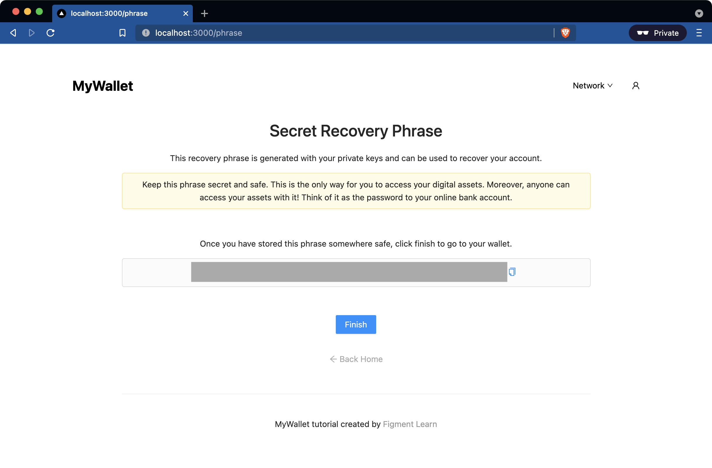
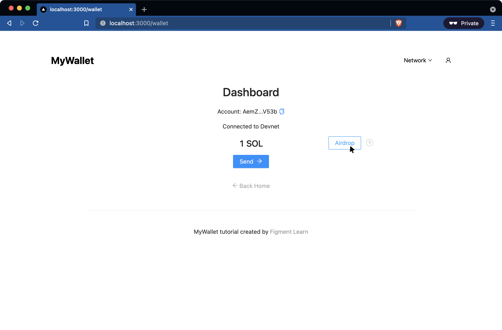
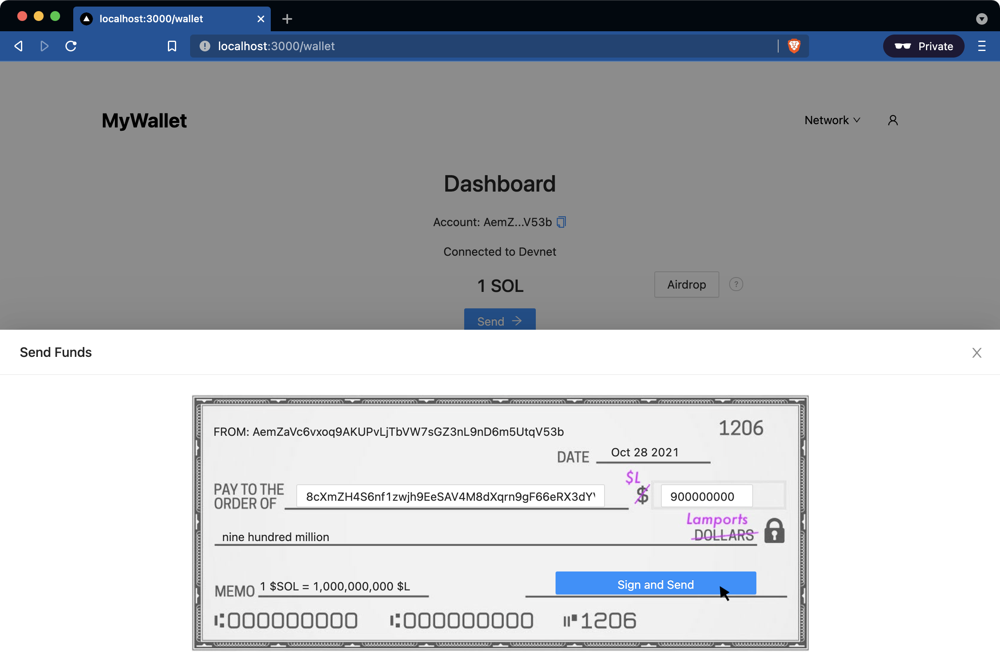

# Wallet Tutorial

In this tutorial, you'll learn to develop a wallet for the [Solana](https://solana.com/) protocol. As you build, we'll dive into some of the fundamentals of Web 3 so you can start cultivating an understanding for blockchain technology and decentralized applications (dApps).

### Prerequisites

There are no formal blockchain or Web 3 prerequisites for this tutorial, but you should have some experience with [TypeScript](https://www.typescriptlang.org/) and [React](https://reactjs.org/). Ideally you have heard about [Solana](https://solana.com/), and know that it's a public blockchain protocol capable of running smart contracts with significant scalability advantages.

Having said that, feel free to give it a shot even if you don't meet the above prerequisites since you'll likely get a lot out of it anyway. Just be extra patient because it may be a bit more difficult to navigate the pre-built app and the Solana functionality we'll be developing.

## Step 1: Up and Running

### System Dependencies

Make sure you have [git](https://git-scm.com/book/en/v2/Getting-Started-Installing-Git), [Node](https://nodejs.org/en/) and [yarn](https://yarnpkg.com/getting-started/install) installed.

### Setting Up

You'll be building Solana interactions on top of a [Next.js](https://nextjs.org/) app that we have pre-built for you. This way you can skip the development phase you're familiar with (e.g. writing React components and Next pages) and dive right into the blockchain-specific phase.

First, clone [the repo](https://github.com/figment-networks/wallet-tutorial) in your system and install the app dependencies by running the following three commands in your terminal:

##### *Listing 1.1: Set up commands to run on your terminal*

```
$ git clone https://github.com/figment-networks/wallet-tutorial.git
$ cd wallet-tutorial
$ yarn
```

Then, run `yarn dev` in your terminal to start the development server on port 3000. The terminal should print output similar to that in [Listing 1.2](#listing-12-terminal-message-on-app-start-up) informing you that the app is available to be viewed at [http://localhost:3000](http://localhost:3000).

##### *Listing 1.2: Terminal message on app start up*

```
yarn run v1.22.11
$ next dev
ready - started server on 0.0.0.0:3000, url: http://localhost:3000
info  - Using webpack 5. Reason: Enabled by default https://nextjs.org/docs/messages/webpack5
event - compiled successfully
```

### Tutorial Structure

The tutorial is structured as a set of steps that break down the process of developing the wallet functionality for the pre-built Next.js app. Each step discusses key concepts and mental models that create the necessary context for you to better understand what we're building and why. Think of this as the warm up.

The discussion is followed by a challenge that aims to give you just enough instructions and references to allow you to implement the functionality on your own if you want to take a shot at it. This allows you to exercise [active recall](https://en.wikipedia.org/wiki/Active_recall) and increases your mind's ability to make connections.

After the challenge, we provide a step-by-step discussion of building the functionality including a code snippet of the full solution. After building context with the warm up and scaffolding your mental model with the challenge, this serves as a way for us to guide you through the logic of the implementation and helps solidify what you learned.

### App Preview

By the time you're done with this tutorial, you'll have a functional wallet capable of changing the state of the Solana blockchain by receiving and transferring on-chain funds. In [Step 2](#step-2-creating-a-wallet), we'll create a wallet by generating a special phrase unique to that wallet.



Then we'll build a function to fetch the balance of our newly created wallet in [Step 3](#step-3-fetching-a-balance) before leveraging functionality to issue "test tokens" through something called an "airdrop" that we'll explore in [Step 4](#step-4-airdropping-funds).




Having added funds to our wallet, we'll build the ability to transfer funds to another wallet in [Step 5](#step-5-transferring-funds).



Finally, we'll use the phrase we generated in [Step 2](#step-2-creating-a-wallet) to sign into an account and recover access to it in [Step 6](#step-6-recovering-an-account).


Although building a production-ready, non-custodial wallet like Phantom or MetaMask is beyond the scope of this tutorial, by the end of it you'll have developed a foundation of judgment that will let you better allocate your learning time as you explore new projects. To assist with that, we'll end the tutorial with a list of [additional resources](#additional-resources) that you'll be well prepared to explore.

## Step 2: Creating a Wallet

Crypto wallets are the most critical piece of user-facing infrastructure in the blockchain space. In the same way that the browser brought the web to a mass audience by providing an easy-to-use gateway into the web's underlying servers and databases, wallets provide users with an easy-to-use gateway into blockchain protocols.

A wallet is less like the wallet you use for your credit cards, and a lot more like a key chain. If you think of a blockchain as a giant safe with digital safety deposit boxes, wallets are the key chains where you keep the keys to your box. Once you have access to a box, you can manage the contents of it by receiving, sending, and spending digital assets.

We can think of the box itself as a chunk of memory on the blockchain. The digital box location is referred to as a public key, or more intuitively a public address and can be shared with anyone in the same way you might share your address to receive mail at home. As the name implies, this is widely available to others on the network and it is the identifier others use to send digital assets to someone's box.

The key that can unlock the safety deposit box is referred to as a private key. Anyone with access to a box's private key has access to the box, which is why it's important for users to keep the key private - hence the name, private key.

In this tutorial, we'll be building a type of wallet called a Hierarchical Deterministic (HD) wallet. We don't need to dive into the full definition of HD wallets here, but it's important to know that they enable the ability to store the private key as a 12-, 18-, or 24-word phrase referred to as a secret recovery phrase or mnemonic phrase. You'll be using a JavaScript library called Bip39 to facilitate the generation of this phrase, which in turn can be converted into a private key to create a wallet.

### Challenge

If you haven't already, run and open the app in your browser at [http://localhost:3000](http://localhost:3000). You'll notice the frontend offers the user the ability to create a new wallet. Clicking on **Create New Wallet** routes the user to a `/generate` page signaling to our user that by clicking **Generate**, the app will generate a key phrase (i.e. the app will create a wallet). But when we click **Generate**, we're routed to a `/phrase` page with an empty phrase container.

For the app to work, we need to implement a function that generates a phrase and uses it to create a wallet when this page renders. In your editor, navigate to `pages/phrase.tsx` and follow the steps included as comments to finish writing the function. We include a description along with a link to the documentation you need to review in order to implement each line. The relevant code block is also included in [Listing 2.1](#listing-21-instructions-for-generating-a-phrase-and-creating-a-wallet) below.

##### *Listing 2.1: Instructions for generating a phrase and creating a wallet*

```javascript
useEffect(() => {
  // *Step 1*: implement a function that generates a mnemonic when the page renders, and uses it to create a wallet (i.e. account)
  // (a) review the import guidance on lines 9 and 11
  // (b) generate a mnemonic phrase by importing Bip39 and then implementing the appropriate method on the imported Bip39 instance
  // Documentation Reference: https://github.com/bitcoinjs/bip39
  const generatedMnemonic = "";

  // This line saves the mnemonic phrase to context state so we can display it for the wallet user to copy
  setMnemonic(generatedMnemonic);

  // (c) convert the mnemonic to seed bytes
  // Documentation Reference: https://github.com/bitcoinjs/bip39
  const seed = new Uint8Array();

  // (d) use the seed to generate a new account (i.e. a new keypair)
  // Documentation Reference: https://solana-labs.github.io/solana-web3.js/
  const newAccount = null;

  // This line sets the account to context state so it can be used by the app
  setAccount(newAccount);
}, []);
```

### Implementation

In order to generate the phrase, we need to leverage an external library that satisfies the [BIP39 specification](https://github.com/bitcoin/bips/blob/master/bip-0039.mediawiki). Fortunately, there's the [Bip39 library](https://github.com/bitcoinjs/bip39), which provides us with the functionality we need to generate the phrase and later convert it into the seed we need to generate our Solana wallet keys.

We already installed the library when we ran `yarn` during set up because we included it into the [package.json](https://github.com/figment-networks/wallet-tutorial/blob/main/package.json) included in the pre-built app. So all that's left is to import it:

```javascript
import * as Bip39 from "bip39";
```

Recall that secret recovery phrases are also called mnemonics and Bip39 includes a method for generating mnemonic phrases, `generateMnemonic()`. We can call it and replace the variable currently assigned to an empty string:

```javascript
const generatedMnemonic = Bip39.generateMnemonic();
```

This allows us to set the phrase in state and display it for our wallet user to store safely. In fact, with this we have already created our wallet or account because the phrase by itself will allow its holder to access the account that matches it. You could say that blockchain accounts aren't created. Because these accounts are mathematical addresses in a system where the number of accounts is established by its architecture, it's more accurate to think of the mnemonic as obtaining the key to access a pre-existing account.

>Consider Aside: why phrases are also called mnemonics

But we need one more step to establish a connection to the account. We need to convert the phrase into a form that the blockchain can understand. Mnemonic phrases after all are abstractions that translate a long, archaic number into a more human-friendly form.

We need to convert the phrase into bytes so the Solana web3.js library can use it to generate an account. An account is referred to as a keypair. That is, a public key that can encrypt data and a private key that can decrypt data.

>Consider Aside: brief overview of keypairs

By reviewing Solana's web3.js documentation, we can see that there is a Keypair class defined as "an account keypair used for signing transactions." This is exactly what we need to generate using the mnemonic phrase.

We notice that the Keypair class has a method, `fromSeed` that generates a keypair from a 32-byte seed. It also mentions that the seed needs to be a `Uint8Array`, which means we'll need a way to convert our `string` phrase into a `Uint8Array`.

Going back to the Bip39 library we see a method called `mnemonicToSeedSync(mnemonic)` that returns some sort of `Buffer` object that looks like a list of hexadecimal numbers. We can test this by running it in our application and passing in the mnemonic we generated:

```javascript
const seed = Bip39.mnemonicToSeedSync(generatedMnemonic);
console.log(seed)

// console:
> Uint8Array(64);
```

It looks like we're close. The `Keypair` class requires a 32-byte `Uint8Array` and we're getting a 64-byte `Uint8Array`. We can slice the seed and keep only the first 32 bytes:

```javascript
const seed = Bip39.mnemonicToSeedSync(generatedMnemonic).slice(0, 32);
console.log(seed)

// console:
> Uint8Array(32);
```

With the seed in that format, we can use `Keypair`'s `fromSeed` method to generate an account keypair:

```javascript
const newAccount = Keypair.fromSeed(seed);
```

We then set the account into the context state manager and we have access to a Solana wallet. Before you click **Finish**, save the recovery phrase as we'll be using it in [Step 6](#step-6-recovering-an-account) to access it once we've logged out. Once you click on **Finish**, you'll be routed to the wallet page that displays the account's dashboard.

You'll notice this page includes a few other features. We'll discuss the Network dropdown in [Step 3](#step-3-fetching-a-balance) while implementing the crucial functionality of showing users their balance in the next step. In [Step 4](#step-4-airdropping-funds) we'll dive into airdrops and make the **Airdrop** button functional, and in [Step 5](#step-5-transferring-funds) we'll enable the Send button and transfer funds.

##### *Listing 2.2: Code for creating a wallet*

```javascript
const generatedMnemonic = Bip39.generateMnemonic();
setMnemonic(generatedMnemonic);

const seed = Bip39.mnemonicToSeedSync(generatedMnemonic).slice(0, 32);
const newAccount = Keypair.fromSeed(seed);
setAccount(newAccount);
```

## Step 3: Fetching a Balance

Crypto wallets serve one key function. By storing your private keys, they allow you to manage - transfer, receive, organize - your digital assets. Part of that function requires the wallet to retrieve certain data that is stored on the blockchain to display on your user dashboard. Balances are one of the most important pieces of information users view on their wallet dashboards.

A balance represents a certain amount of cryptocurrency or tokens held by a specific account. If you think of the blockchain as a database that keeps ownership records, and of the public keys as the owner IDs, then you can think of the balances as an integer column in the database that tracks how much of a certain token each owner ID holds.

We'll be connecting to one of Solana's networks, and fetching the balance for the account we just created. Later in [Step 4](#step-4-airdropping-funds), we'll be funding the account with test tokens using the airdrop function.

The concept of various networks for a single protocol is similar to that of different environments for an app (e.g. development, test, production, etc). Typically blockchain protocols have a main network or mainnet, which refers to the production blockchain with real economic value and official transactions, and at least one experimentation network, which refers to an identical blockchain used to test features before they go live on mainnet.

Solana has a production network called mainnet and two exploration networks called testnet and devnet. Solana's devnet is designed for developers and users to play with various features and debug dApps before launching on mainnet with real economic consequences. The testnet is where the Solana protocol tests new releases and potential protocol updates.

You'll notice the wallet includes a dropdown at the top-right that allows users to select what network they want to connect to. This allows the wallet to manage assets specific to the connected network. Our default network is devnet since we'll be using it to leverage test tokens in [Step 4](#step-4-airdropping-funds) and then transfer them in [Step 5](#step-5-transferring-funds), but the functionality we'll build will work for any of the Solana networks.

### Challenge

In the last step, we discussed how a wallet is more like a keychain that holds keypairs representing an account address and the key to access it. We built a function that allowed us to generate a unique account and the corresponding phrase that works like a password for accessing the account. Now we need to connect with the Solana blockchain so we can fetch the account's balance, which at this point should be zero since we just created it.

If you open the browser's console from the `/wallet` page, you'll notice a message that reads, "Balance functionality not implemented yet!". Navigate to `utils/index.ts` in your editor and follow the steps included as comments to finish writing the `refreshBalance` function. We include a description along with a link to the documentation you need to review in order to implement each line. The relevant code block is also included in [Listing 3.1](#listing-31-instructions-for-fetching-an-accounts-balance) below.

##### *Listing 3.1: Instructions for fetching an account's balance*

```javascript
// *Step 3*: implement a function that gets an account's balance
const refreshBalance = async (network: Cluster, account: Keypair | null) => {
  if (!account) return 0;

  try {
    // (a) review the import guidance on line 1
    // (b) instantiate a connection using clusterApiUrl with the active network
    // Documentation References:
    //   https://solana-labs.github.io/solana-web3.js/classes/Connection.html
    //   https://solana-labs.github.io/solana-web3.js/modules.html#clusterApiUrl
    console.log("Balance functionality not implemented yet!")
    const connection = "";

    // (c) get the key using one of the accessors for active account
    // Documentation Reference: https://solana-labs.github.io/solana-web3.js/classes/Keypair.html
    const publicKey = "";

    // (d) get the account's balance using the connection instance
    // Documentation Reference: https://solana-labs.github.io/solana-web3.js/classes/Connection.html
    const balance = 0

    return balance
  } catch (error) {
    console.log(error);
    return 0;
  }
};
```

### Implementation

The first step for interacting with any blockchain is to instantiate a connection. Conveniently there's a Connection class in web3.js designed to do just that. By reviewing the documentation, we notice the Connection constructor requires two argument: `endpoint: string` and `commitmentOrConfig?: Commitment | ConnectionConfig`.

The description for `endpoint` mentions that it's a "URL to the fullnode JSON RPC endpoint". Since we don't have a URL for the connection, we need to either find one from Solana or look for a function that will return a URL. By searching the web3.js docs for "URL", we see that there's a function called `clusterApiUrl` that returns the "RPC API URL for the specified cluster". Moreover, if we review the Cluster type, we see that it refers to the network we want to connect to.

As for `commitmentOrConfig`, it looks like the definition for `Commitment` types describes it as the "level of commitment desired when querying state", which is a meaningless definition to us at this point. However it looks like `Commitment` can be one of several strings so we should choose one and test the function. In this case, we can choose "confirmed" as a reasonable guess and move forward.

>Consider Aside: [technical sophistication](https://www.securemac.com/news/the-securemac-interview-michael-hartl-on-technical-sophistication) and give shout out to Hartl

Putting the above together, we can build our connection instance:

```javascript
const connection = new Connection(clusterApiUrl(network), "confirmed");
console.log(connection)

// console:
> Connection {_commitment: 'confirmed', _confirmTransactionInitialTimeout: undefined, _rpcEndpoint: 'https://api.devnet.solana.com', _rpcWsEndpoint: 'wss://api.devnet.solana.com/', _rpcClient: ClientBrowser, …}
```

Now that we have a connection, we need to fetch our account's balance. We might speculate that there should be a `getBalance` function that takes an account's public address as a parameter, and returns the account's balance. Searching for the keyword "balance" in the web3.js docs, we can see that, not only is there a `getBalance` method, but it's a method of the `Connection` class.

Reviewing the `getBalance` method on `Connection`, we can see it expects the account's public key as a parameter.

```javascript
const publicKey = account.publicKey;
const balance = await connection.getBalance(publicKey);
console.log(balance);
```

There are a few ways to structure this part of the function. We've chosen to assign a variable, `publicKey`, to the account's public key, and then pass that into `getBalance` to query the network for the balance.

From the docs, we know `getBalance` returns a promise so we use `await` and assign its return value to the `balance` variable. By logging `balance`, we can see our account has zero balance as expected.

But that's a bit anticlimactic. We know it's a new account and it should have zero balance. Nothing changed on the frontend because the default value was zero. We need to fund the account to see the balance change, and we'll do just that in the next step.

##### *Listing 3.2: Code for fetching a balance*

```javascript
const refreshBalance = async (network: Cluster, account: Keypair | null) => {
  if (!account) return;

  try {
    const connection = new Connection(clusterApiUrl(network), "confirmed");
    const publicKey = account.publicKey;
    const balance = await connection.getBalance(publicKey);
    return balance;
  } catch (error) {
    console.log(error);
    return 0;
  }
};
```

## Step 4: Airdropping Funds

We've now generated a wallet and connected it to the Solana blockchain. In the previous step, we confirmed that our account's balance is zero but wouldn't it be nice to fund our account so we can see the balance change? You might be wondering whether we'll now need to transfer real money so we can test the account, but as we discussed in [Step 3](#step-3-fetching-a-balance), a blockchain's devnet typically provides a way to test transactions without risking real economic value.

In this step, we'll be building functionality to allow users to "airdrop" SOL tokens into their devnet account. In the crypto world, an airdrop is a way for the protocol to distribute tokens to account holders for free. In this case, we'll be tapping into the native devnet airdrop functionality built into Solana to fund our account. This is in contrast to mainnet airdrops performed by blockchain protocols and crypto projects, which are usually issued to reward early adopters or contributors.

>Consider Aside: famous project airdrops and how it "pays" to be an early adopter in crypto

On the right of the wallet dashboard, you'll find a button with the label **Airdrop**. You might notice that this button goes away if you change the network. This is because the functionality we're implementing is only active for devnet. Moreover, you'll notice a tooltip help icon informing users that they'll receive 1 devnet SOL by clicking on **Airdrop**.

Once we've completed this step, our balance will automatically increase when we click **Airdrop**. This will position us well for [Step 5](#step-5-transferring-funds) where we'll build functionality to send funds to other Solana accounts.

### Challenge

If you open the browser's console from the `/wallet` page, and click on the **Airdrop** button, you'll notice a message that reads, "Airdrop functionality not implemented yet!". Navigate to `utils/index.ts` in your editor and follow the steps included as comments to finish writing the `handleAirdrop` function. We include a description along with a link to the documentation you need to review in order to implement each line. The relevant code block is also included in [Listing 4.1](#listing-41-instructions-for-writing-airdrop-function) below.

##### *Listing 4.1: Instructions for writing airdrop function*

```javascript
// *Step 4*: implement a function that airdrops SOL into devnet account
const handleAirdrop = async (network: Cluster, account: Keypair | null) => {
  // This line ensures the function returns before running if no account has been set
  if (!account) return;

  try {
    // (a) review the import guidance on line 1
    // (b) instantiate a connection using clusterApiUrl with the active network
    // Documentation References:
    //   https://solana-labs.github.io/solana-web3.js/classes/Connection.html
    //   https://solana-labs.github.io/solana-web3.js/modules.html#clusterApiUrl
    console.log("Airdrop functionality not implemented yet!")
    const connection = "";

    // (c) get the key using one of the accessors for active account
    // Documentation Reference: https://solana-labs.github.io/solana-web3.js/classes/Keypair.html
    const publicKey = "";

    // (d) request the airdrop using the connection instance
    // Note that you should include the amount to airdrop (consider using the LAMPORTS_PER_SOL constant from the web3.js library)
    // Documentation Reference: https://solana-labs.github.io/solana-web3.js/classes/Connection.html
    const confirmation = ""

    // (d) confirm the transaction using the connection instance and the confirmation string returned from the airdrop
    // Documentation Reference: https://solana-labs.github.io/solana-web3.js/classes/Connection.html
    const result = ""

    // (e) Refactor the refreshBalance function to return balances in SOL instead of Lamports

    // This line returns the balance after the airdrop so the UI can be refreshed
    return await refreshBalance(network, account);
  } catch (error) {
    console.log(error);
    return;
  }
};
```

### Implementation

In [Step 3](#step-3-fetching-a-balance) we learned how to instantiate a connection to one of Solana's networks, and how to assign our account's public key property to a variable, so we can apply that same code here:

```javascript
const connection = new Connection(clusterApiUrl(network), "confirmed");
const publicKey = account.publicKey;
```

Following our previous heuristic of searching the docs for keywords, we can now search for "airdrop" to see if perhaps there's a function we can leverage. Lo an behold the `Connection` class has a `requestAirdrop` function that looks promising. It takes in a public key and a lamports number, and returns a promise that resolves to a string. You might be wondering what a "lamport" is. Solana's native token, SOL, is divisible into 1 billion lamports. You can think of lamports as the cents to SOL's dollar.

>Consider Aside: Leslie Lamport

It's not clear from the documentation, but after a little research you can confirm that the returned string represents a confirmation ID or signature. From a function design standpoint, it seems reasonable that to request an airdrop we should pass in the account address (public key) and the amount of funds we're requesting.

```javascript
const confirmation = await connection.requestAirdrop(publicKey, 1000000000);
```

The above function will work just fine and our users will be able to airdrop 1 SOL every time they click on the button. But you can clean it up a bit by leveraging the `LAMPORTS_PER_SOL` constant from web3.js.

```javascript
const confirmation = await connection.requestAirdrop(
  publicKey,
  LAMPORTS_PER_SOL
);
```

Finally, before we can refresh our account's balance automatically, we need a way to make sure the blockchain ledger has been updated with our airdropped funds before we call `refreshBalance`. As with any database-type operations, blockchain state changes are asynchronous. In fact, given the decentralized nature of most blockchain protocols, some updates [can take a while](https://twitter.com/CryptoKitties/status/937444644740198400?s=20).

With that in mind, we need to wait for the airdrop to be confirmed before refreshing the balance. Searching the docs once again, we can see that our Connection class includes a confirmTransaction method that takes in a confirmation signature and commitment, and returns a promise that resolves once the transaction is confirmed by the network.

```javascript
await connection.confirmTransaction(confirmation, "confirmed");
```

Note that we don't need to assign a variable to the confirmation here. Once our wallet knows that the transaction was confirmed by the network, it can call `refreshBalance` and update the balance for the account.

```javascript
return await refreshBalance(network, account);
```

Avid readers might have noticed that the balance in our account looks wrong. It reads one billion SOL when it should read 1 SOL. Now that we know what lamports are, how they relate to SOL, and how to use the `LAMPORTS_PER_SOL` constant, we can go back to our `refreshBalance` function and fix the bug by updating the return value.

```javascript
return balance / LAMPORTS_PER_SOL;
```

We've come a long way and now have a better idea of how blockchain protocols work. We built a wallet by creating a keypair, connected to the network, fetched data from it, and successfully requested test tokens. We've covered all of the basic Web 3 interactions except the most important one - transferring funds. We'll do that next in [Step 5](#step-5-transferring-funds), so buckle up.

##### *Listing 4.2: Code for airdropping funds*

```javascript
const handleAirdrop = async (network: Cluster, account: Keypair | null) => {
  if (!account) return;

  try {
    const connection = new Connection(clusterApiUrl(network), "confirmed");
    const publicKey = account.publicKey;
    const confirmation = await connection.requestAirdrop(
      publicKey,
      LAMPORTS_PER_SOL
    );
    const result = await connection.confirmTransaction(confirmation, "confirmed");
    return await refreshBalance(network, account);
  } catch (error) {
    console.log(error);
    return;
  }
};

const refreshBalance = async (network: Cluster, account: Keypair | null) => {
  if (!account) return;

  try {
    .
    .
    .
    return balance / LAMPORTS_PER_SOL
  } catch (error) {
    .
    .
    .
  }
};
```

## Step 5: Transferring Funds

Now that we've funded our account with test tokens on devnet, we can start to think about how we might use those funds. In a real-world application, we might want to swap SOL for another token, pay for a good or service in SOL, or even gift someone some SOL. To do that we need a way to let the network ledger know that our account should transfer funds to another account.

Thinking about it from first principles, we know we'll need a function that takes in two addresses - the sender and the recipient. We also know that we'll need to pass in an amount - the number of SOL or Lamports that we want to send.

But there's one more key component: we need to prove to the network that we are in fact the owner of those funds and that we approve the transfer.

Consider a traditional paper check that you might use to pay your landlord. The check has your name and address printed on the top left. It includes a field for you to write the recipient's name along with a field for you to write the amount you're paying her. Finally, it includes a field for you to sign the check to validate to the bank that you're approving the transfer.


Let's pretend that banks actually use those signatures to validate it was actually you who signed it (spoiler alert: they don't for the most part). The blockchain model of transferring funds is pretty similar. You need a way to sign the transaction so the network can confirm it as valid and change the balances of the corresponding accounts.

The concept of cryptographic signing is fascinating, but well beyond the scope of this tutorial. We'll provide [additional resources](#additional-resources) if you want to explore it more in-depth, but suffice it to say that your keys, along with hashing algorithms and something called a one-way function, are designed for this very purpose.

>Consider Aside: simple description on the basics of public key cryptography

With those building blocks in mind, we're ready to search the docs for a way to send and confirm a transaction.

### Challenge

If you click on the **Send** button on the wallet dashboard, a drawer component opens up that shows a form structured as a paper check thus building on our analogy above. It includes all the components of a transaction but the **Sign and Send** button doesn't work yet.

Navigate to `components/TransactionLayout/index.tsx` in your editor and follow the steps included as comments to finish writing the `transfer` function. We include a description along with a link to the documentation you need to review in order to implement each line. The relevant code block is also included in [Listing 5.1](#listing-51-instructions-for-writing-transfer-function) below.

##### *Listing 5.1: Instructions for writing transfer function*

```javascript
// *Step 5*: implement a function that transfer funds
const transfer = async () => {
  // This line ensures the function returns before running if no account has been set
  if (!account) return;

  try {
    // (a) review the import guidance on line 1
    // (b) instantiate a connection using clusterApiUrl with the active network
    // Documentation References:
    //   https://solana-labs.github.io/solana-web3.js/classes/Connection.html
    //   https://solana-labs.github.io/solana-web3.js/modules.html#clusterApiUrl
    console.log("Sign and Send not yet implemented!");
    const connection = "";
    setTransactionSig("");
    // (c) leverage the SystemProgram class to create transfer instructions that include your account's public key, the public key from your sender field in the form, and the amount from the form
    // Documentation Reference:
    //   https://solana-labs.github.io/solana-web3.js/classes/SystemProgram.html
    //   https://solana-labs.github.io/solana-web3.js/classes/SystemProgram.html#transfer
    const instructions = {};

    // (d) instantiate a transaction object and add the instructions
    // Documentation Reference:
    //   https://solana-labs.github.io/solana-web3.js/classes/Transaction.html
    //   https://solana-labs.github.io/solana-web3.js/classes/Transaction.html#add
    const transaction = {};

    // (e) use your account to create a signers interface
    // Documentation Reference:
    //   https://solana-labs.github.io/solana-web3.js/interfaces/Signer.html
    //   note: signers is an array with a single item - an object with two properties
    const signers = [{}];

    setSending(true);
    // (f) send the transaction and await its confirmation
    // Documentation Reference: https://solana-labs.github.io/solana-web3.js/modules.html#sendAndConfirmTransaction
    const confirmation = "";
    setTransactionSig(confirmation);
    setSending(false);

    const updatedBalance = await refreshBalance(network, account);
    setBalance(updatedBalance);
    message.success(`Transaction confirmed`);
  } catch (error) {
    console.log(error);
    message.error(
      "Transaction failed, please check your inputs and try again"
    );
  }
};
```

### Implementation

Based on [Step 3](#step-3-fetching-a-balance) and [Step 4](#step-4-airdropping-funds) we know that we're going to need a connection to the network. We can once again leverage our previous code:

```javascript
const connection = new Connection(clusterApiUrl(network), "confirmed");
```

We can guess that we'll need to build some sort of transaction object and send it through the connection, but it's not immediately obvious how we might do that. By searching the docs, it looks like there are two ways to send transactions - the `Connection` method `sendTransaction` and the general function `sendAndConfirmTransaction`. We're going to want to request a confirmation so we can update our balance after sending the transaction, so the latter seems like a good option to try.

Reading through the function's specs, it looks like we need to pass in a connection, some sort of `transaction` object and a `signers array`. Moreover, the description says that this function will "sign, send and confirm a transaction" so it looks like we're on the right track. We can begin by importing this function and using it, knowing that we're going to build out its inputs next.

```javascript
const confirmation = await sendAndConfirmTransaction(
  connection,
  transaction,
  signers
);
```

We already have a connection, so we can immediately turn to the transaction parameter. Following the link to the `Transaction` parameter in the docs, it looks like to create a `transaction` object, we can use its constructor.

```javascript
const transaction = new Transaction()
console.log(transaction)

// console:
> Transaction {signatures: Array(0), feePayer: undefined, instructions: Array(0), recentBlockhash: undefined, nonceInfo: undefined}
```

Looking at the transaction we created, it clearly lacks any of the components we need for a valid transaction like `sender`, `recipient` and `amount`, but it seems to have a rational structure that we should be able to populate. You could research each of them, but let's jump right into `instructions` property as it seems like a promising place to start.

Unfortunately, the docs aren't very intuitive in how to progress but don't worry. There's a very useful class called `SystemProgram` with a `transfer` method that "generates a transaction instruction that transfers lamports from one account to another." This seems like exactly what we need.

The `transfer` method takes in an object of `TransferParams` type that requires a `sender`, `recipient` and `amount` in lamports. That matches the data we're hoping to use for our transaction and we can get that from state from our account and form. The resulting instructions look like this:

```javascript
const instructions = SystemProgram.transfer({
  fromPubkey: account.publicKey,
  toPubkey: new PublicKey(form.to),
  lamports: form.amount,
});
```

To incorporate these into our transaction, we can use the `add` method:

```javascript
transaction.add(instructions);
```

Or with a bit of on the fly refactoring, we can simply instantiate the transaction after creating the instructions and add them immediately:

```javascript
const transaction = new Transaction().add(instructions);
```

We have two out of the three parameters ready for the `sendAndConfirmTransaction` function, `connection` and `transaction`. Now we need the `signers array`. From the function's specification, we know `signers` will be an array with at least one `Signer` object. Reviewing the `Signer` type in the docs, it looks like it's an object with two properties - `publicKey` and `privateKey`. We can get both of those from our `account`, so we can build the `signers array`.

```javascript
const signers = [
  {
    publicKey: account.publicKey,
    secretKey: account.secretKey,
  },
];
```

Now that all three parameters are complete, we can finally call `sendAndConfirmTransaction` and await its confirmation.

```javascript
const confirmation = await sendAndConfirmTransaction(
  connection,
  transaction,
  signers
);
```

We have a fully functional feature capable of transferring funds between Solana accounts. To complete the feature, we need to make sure we call the `refreshBalance` function to update the account's balance after transferring funds.

```javascript
const updatedBalance = await refreshBalance(network, account);
setBalance(updatedBalance);
```

You should make sure you airdropped some devnet SOL into your account and test transferring some SOL to another account, preferably another account that you also control. Once you fill in the public address of your recipient amount and the amount, say 1,000,000 Lamports, the **Sign and Send** button will be enabled. Once you click sign and send you will see a successful message displayed at the top along with a link at the top left of the check to the [Solana Block Explorer](https://explorer.solana.com/?cluster=devnet).

The [Solana Block Explorer](https://explorer.solana.com/?cluster=devnet) is a simple dashboard that allows you to search for specific blocks, accounts, transactions, contracts and tokens by network. It displays all the information related to the item you searched for. In this case, if you click the link, you'll be able to see a basic overview of the transfer you just issued. In the middle of the page, you'll see our transfer's information - mainly, the sender (your public address) and how much SOL you sent; and the recipient (the other public address) and how much SOL they received.

At this point, your Solana wallet is almost complete, except for one major flaw. You can create a wallet, and even transfer funds from it. But you can't access an existing wallet. We'll fix that in [Step 6](#step-6-recovering-an-account) where we'll be once again leverage the Bip39 library to access an account based on a mnemonic phrase.

##### *Listing 5.2: Code for transferring funds*

```javascript
const transfer = async () => {
  if (!account) return;

  try {
    setTransactionSig("");

    const connection = new Connection(clusterApiUrl(network), "confirmed");

    const instructions = SystemProgram.transfer({
      fromPubkey: account.publicKey,
      toPubkey: new PublicKey(form.to),
      lamports: form.amount,
    });

    const transaction = new Transaction().add(instructions);

    const signers = [
      {
        publicKey: account.publicKey,
        secretKey: account.secretKey,
      },
    ];

    setSending(true);
    const confirmation = await sendAndConfirmTransaction(
      connection,
      transaction,
      signers
    );
    setTransactionSig(confirmation);
    setSending(false);

    const updatedBalance = await refreshBalance(network, account);
    setBalance(updatedBalance);
    message.success(`Transaction confirmed`);
  } catch (error) {
    message.error("Transaction failed, please check your inputs and try again");
    console.log(error);
  }
};
```

## Step 6: Recovering an Account

Getting access to accounts is obviously a critical feature for any wallet application, and given our choice of architecture, we don't have to worry about encrypting and decrypting passwords to log in and out.

The beauty of public-key cryptography is that the private key is effectively your password. And while securing crypto applications is more sophisticated than simply using your private key as a password, especially for industrial-strength wallets, we can achieve the basic functionality of accessing a wallet by leveraging what we learned in [Step 2](#step-2-creating-a-wallet) for creating wallets.

Recall that we've built a type of wallet called a Hierarchical Deterministic (HD) wallet, which means we can map our 12-word phrase to a seed. Since the keypair that makes the account is derived from this seed, as long as we have access to the recovery phrase, we can get access to the keypair and therefore the account.

>Consider Aside: in the context of an industrial-strength wallet, you'll be using the phrase as a recovery mechanism and will leverage other simpler methods for day-to-day access but the analogy of the phrase serving as a type of very secure but somewhat cumbersome password still holds

If you saved your test account's recovery phrase, we'll use it now. Feel free to click log out at the top right. Once we've finished this step, you'll once again have access to your devnet SOL.

### Challenge

You should be in the app's home page at [http://localhost:3000](http://localhost:3000). If you click on the **Get Existing Wallet** button, you'll be routed to the page for importing the recovery phrase. But if you click on **Import** after pasting your phrase, you'll notice a message in the console that reads, "Recovery functionality not implemented yet!".

For this feature to work, we need to implement a function that uses the phrase to generate a seed, and then uses the seed to retrieve the keypair (i.e. access the account). Navigate to `pages/recover.tsx` in your editor and follow the steps included as comments to finish writing the function. We include a description along with a link to the documentation you need to review in order to implement each line. The relevant code block is also included in [Listing 6.1](#listing-61-instructions-for-writing-recover-function) below.

##### *Listing 6.1: Instructions for writing recover function*

```javascript
// *Step 6*: implement a function that recovers an account based on mnemonic
const handleImport = async (values: any) => {
  setLoading(true);
  const inputMnemonic = values.phrase.trim().toLowerCase();
  setMnemonic(inputMnemonic);

  // (a) review the import guidance on lines 9 and 11
  // (b) convert the mnemonic to seed bytes
  // Documentation Reference: https://github.com/bitcoinjs/bip39
  const seed = new Uint8Array();

  // (c) use the seed to import the account (i.e. keypair)
  // Documentation Reference:
  //   https://solana-labs.github.io/solana-web3.js/classes/Keypair.html
  //   https://solana-labs.github.io/solana-web3.js/classes/Keypair.html#fromSeed
  const importedAccount = null;
  setAccount(importedAccount);
};
```

### Implementation

Recall that in [Step 2](#step-2-creating-a-wallet) we first generated a mnemonic phrase with the Bip39 library by leveraging the `generateMnemonic` function. Then, in order to generate a keypair, we had to convert the phrase to a seed that could be be consumed by Solana's `Keypair` class to generate the `Keypair` that would grant us access to the account.

In this case, we already have a phrase because the user imported it but the rest of the code mirrors [Step 2](#step-2-creating-a-wallet). We can convert the phrase into a seed and then leverage the `fromSeed` method from `Keypair` to access the account.

```javascript
const seed = Bip39.mnemonicToSeedSync(inputMnemonic).slice(0, 32);
const importedAccount = Keypair.fromSeed(seed);
```

With those two lines of code, we have effectively implemented authentication and allowed users to access their accounts from any device as long as they have their recovery phrase.

##### *Listing 6.2: Code for Recovering an Account*

```javascript
const handleImport = async (values: any) => {
  setLoading(true);
  const inputMnemonic = values.phrase.trim().toLowerCase();
  setMnemonic(inputMnemonic);

  const seed = Bip39.mnemonicToSeedSync(inputMnemonic).slice(0, 32);
  const importedAccount = Keypair.fromSeed(seed);
  setAccount(importedAccount);
};
```

## Conclusion

Congratulations! You've built a crypto wallet that is capable of managing on-chain digital assets on the Solana protocol. That's no small feat!

By writing a function to generate a mnemonic phrase and using it to create a keypair in [Step 2](#step-2-creating-a-wallet), you linked the wallet app to an account. You then implemented functionality to connect to one of Solana's networks to fetch data from it in [Step 3](#step-3-fetching-a-balance), in this case the account's balance. Next, you wrote functionality to request test tokens via an airdrop in [Step 4](#step-4-airdropping-funds). And after that you sent some of those funds to another account by learning how to initiate and confirm fund transfers in [Step 5](#step-5-transferring-funds). Finally, you learned how to recover an account in [Step 6](#step-6-recovering-an-account) by leveraging the same code we used in [Step 2](#step-2-creating-a-wallet).

In the process of building the wallet, you also learned some of the fundamentals of developing for Web 3. You learned how the frontend part of the stack is identical to what you're already used to. You also learned that interacting with blockchain protocols means leveraging API libraries that help you create, read and update data in a familiar way. Importantly, you learned just enough about public-key cryptography, crypto wallets, and blockchain concepts like airdrops, keypairs, and mnemonics to unlock a whole world of learning paths to explore next.

Web 3 holds a world of promise for the future of the internet. More importantly, there are vasts areas of greenspace for developers to build amazing things and a ton of low hanging fruit to experiment. 

If you want to connect with an amazing community of developers, join us on [Discord](https://discord.gg/fszyM7K). The opportunities are endless and we wish you well on your journey!

## Additional Resources

- [Figment Learn Pathways](https://learn.figment.io/)
- [BIP32](https://github.com/bitcoin/bips/blob/master/bip-0032.mediawiki): On HD Wallets
- [BIP39](https://github.com/bitcoin/bips/blob/master/bip-0039.mediawiki): On Recovery Phrases
- [Why the Blockchain Matters](https://seths.blog/2021/05/why-the-blockchain-matters/) by Seth Godin
- [The Quest for Digital Cash](https://bitcoinmagazine.com/.amp/culture/bitcoin-adam-back-and-digital-cash) by Bitcoin Magazine
- [Solana Documentation](https://docs.solana.com/developing/programming-model/overview)
- [Solana Web3.js Documentation](https://solana-labs.github.io/solana-web3.js/)
- [The Code Book: The Science of Secrecy from Ancient Egypt to Quantum Cryptography](https://www.worldcat.org/title/code-book-the-science-of-secrecy-from-ancient-egypt-to-quantum-cryptography/oclc/738479322) by Simon Singh
- [Crypto: How the Code Rebels Beat the Government Saving Privacy in the Digital Age](https://www.worldcat.org/title/crypto-how-the-code-rebels-beat-the-government-saving-privacy-in-the-digital-age/oclc/44818667) by Steven Levy
